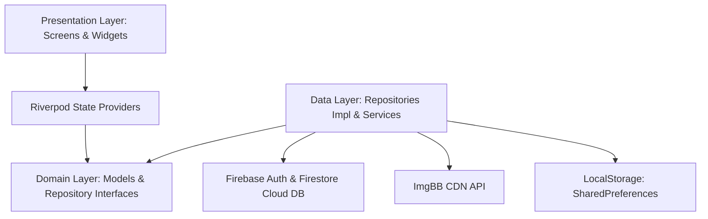

# 🌾 BazaarShodai (বাজার সওদা)

<p align="center">
  
</p>

<p align="center">
  <b>A modern, multi-vendor grocery & fresh farm harvest marketplace tailored for Bangladesh.</b><br/>
  <i>Connecting local farmers, fishermen, and neighborhood merchants directly with everyday consumers.</i>
</p>

<p align="center">
  <a href="https://flutter.dev"></a>
  <a href="https://dart.dev"></a>
  <a href="https://firebase.google.com"></a>
  <a href="https://riverpod.dev"></a>
  <a href="LICENSE"></a>
  <a href="https://github.com/AR-NIHAL/BazaarShodai/pulls"></a>
</p>

---

## 📖 Table of Contents
- [About BazaarShodai](#-about-bazaarshodai)
- [App Showcase & Screenshots](#-app-showcase--screenshots)
- [Key Features](#-key-features)
  - [For Shoppers & Consumers](#-for-shoppers--consumers)
  - [For Farmers & Local Merchants](#-for-farmers--local-merchants)
  - [UI/UX & Design Excellence](#-uiux--design-excellence)
- [System Architecture](#-system-architecture)
- [Project Directory Structure](#-project-directory-structure)
- [Tech Stack & Dependencies](#-tech-stack--dependencies)
- [Getting Started & Installation](#-getting-started--installation)
  - [Prerequisites](#prerequisites)
  - [Environment Variables (.env)](#environment-variables-env)
  - [Firebase Setup](#firebase-setup)
  - [Running the App](#running-the-app)
- [Testing & Code Quality](#-testing--code-quality)
- [Roadmap](#-roadmap)
- [Contributing](#-contributing)
- [License](#-license)
- [Author](#-author)

---

## 🌟 About BazaarShodai

In traditional food distribution chains across Bangladesh, fresh farm produce passes through 3–4 layers of middlemen (*faria*, *arotdar*, *paikar*), inflating consumer prices by up to 60% while farmers receive a fraction of the value. Perishable produce also suffers significant spoilage during transit.

**BazaarShodai (বাজার সওদা)** bridges this gap with an open, transparent, multi-vendor digital marketplace:
- **Direct Farm-to-Table**: Fresh organic vegetables, native river fish (Padma Hilsa, Rui), fresh milk, and pure mustard oil direct from verified growers.
- **Micro-Merchant Empowerment**: Any local farmer or corner grocery merchant can register an online shop in under 2 minutes, upload photos of their stock from their smartphone, and receive customer orders instantly.
- **Frictionless Experience**: Shoppers can freely explore the catalog as guests without forced logins, adding items to their cart with real-time bill calculations and transparent delivery tracking.

---

## 📱 App Showcase & Screenshots

> *Add your screenshots to the [`screenshots/`](screenshots/) directory using the specified filenames below. See [`screenshots/README.md`](screenshots/README.md) for dimensions and guidelines.*

| 🌿 Farm-Fresh Produce | 🏪 Local Seller Storefront | ⚡ Doorstep Delivery | 🛒 Marketplace Home |
|:---:|:---:|:---:|:---:|
|  |  |  |  |
| *Full-Screen Onboarding: Buyers* | *Full-Screen Onboarding: Sellers* | *Transparent Delivery & Rates* | *Hero Banners & Visual Catalog* |

| 🏷️ Category Discovery | 📦 Product Details | 🛍️ Interactive Cart | 💳 Checkout & Payment |
|:---:|:---:|:---:|:---:|
|  |  |  |  |
| *Circular Category Selector* | *Freshness Guarantees & Pricing* | *Reactive Quantity Stepper* | *bKash, Nagad & Cash on Delivery* |

| 🚚 Order Tracking | 📊 Seller Dashboard | 🌙 Sleek Dark Theme | 👤 Profile & Settings |
|:---:|:---:|:---:|:---:|
|  |  |  |  |
| *Live Order Timeline Stages* | *Vendor Inventory & Insights* | *High-Contrast OLED Dark Mode* | *Account, Roles & Theme Switcher* |

---

## ⚡ Key Features

### 🛒 For Shoppers & Consumers
- **Frictionless Guest Browsing**: Browse produce, filter by vendor, view prices, and build a cart without being blocked by registration prompts.
- **Visual Category System**: Circular, responsive category selector with dedicated icons for Vegetables, River Fish, Meat, Dairy, and Spices.
- **Dynamic Promotional Banners**: Interactive multi-banner carousel highlighting regional specialties (Pure Mustard Oil, Fresh Padma Hilsa, Organic Harvest).
- **Reactive Shopping Cart**: Instant item quantity increment/decrement steppers, item removal, and auto-computed delivery & VAT calculations.
- **Multiple Payment Gateways**: Cash on Delivery (COD), bKash, and Nagad integration support.
- **Live Order Tracking**: Chronological stage timeline tracking order verification, packing, out-for-delivery, and completed states.

### 🏪 For Farmers & Local Merchants
- **Rapid 2-Minute Onboarding**: Simple upgrade flow allowing any user to register shop name, phone number, and physical market address.
- **Product Catalog Management**: Create, edit, and update items with titles, categories, weights/units, base prices, and promotional discount percentages.
- **Instant Photo Uploads (ImgBB CDN)**: Take photos from the device camera or gallery; images are hosted on a fast CDN and cached locally.
- **Order Management & Fulfillment**: Dedicated seller portal to review customer orders, update delivery status, and track completed sales.

### 🎨 UI/UX & Design Excellence
- **Editorial Realistic Photography**: Full-bleed background imagery with multi-stop cinematic scrim gradients for crisp readability.
- **Dual Theme Support (Light & OLED Dark)**: Polished Emerald Green (`#059669`) and Warm Amber accents paired with Slate backgrounds, persisted locally across app restarts.
- **Zero-Glitch Responsiveness**: Adaptive layouts tested against mobile phones, tablets, and desktop browsers without rendering overflow stripes.

---

## 🏗️ System Architecture

BazaarShodai is built following **Clean Architecture** with a **Feature-First modular structure**, keeping the domain logic independent from external frameworks and data sources.



### Architectural Principles:
1. **Separation of Concerns**: Presentation (UI widgets), Domain (pure Dart entities and business rules), and Data (remote APIs, Firebase, and local storage).
2. **Unidirectional Data Flow**: State is managed via Riverpod `StateNotifier` and `AsyncNotifier` providers.
3. **Resilient Offline Fallback**: Images and local app preferences utilize a hybrid loader (remote CDN with automatic offline asset fallback).

---

## 📂 Project Directory Structure

```text
lib/
├── core/
│   ├── services/
│   │   └── local_storage_service.dart     # SharedPreferences persistent key-value store
│   └── theme/
│       ├── app_colors.dart                # Design tokens & color palette
│       ├── app_theme.dart                 # Material 3 Light and Dark theme configurations
│       └── theme_provider.dart            # Reactive ThemeMode Riverpod state notifier
│
├── features/
│   ├── auth/                              # Authentication & User Management
│   │   ├── data/repositories/             # AuthRepository implementation with Firebase Auth
│   │   ├── domain/models/                 # UserModel, UserRole (Customer/Seller), ShopDetails
│   │   └── presentation/screens/          # Splash, Onboarding, Login, Signup screens
│   │
│   ├── buyer/                             # Customer Marketplace Experience
│   │   └── presentation/
│   │       ├── screens/                   # HomeScreen, ProductDetailScreen, ProfileScreen
│   │       └── widgets/                   # BannerCarousel, CategorySelector, ProductCard
│   │
│   ├── cart/                              # Cart & Quantity Management
│   │   └── presentation/                  # CartScreen, CartProvider (Reactive cart state)
│   │
│   ├── checkout/                          # Order Finalization & Payment
│   │   ├── domain/models/                 # AddressModel
│   │   └── presentation/                  # CheckoutScreen, AuthPromptSheet
│   │
│   ├── order/                             # Order Lifecycle & Tracking
│   │   ├── data/repositories/             # OrderRepository with Firestore integration
│   │   ├── domain/models/                 # OrderModel, OrderItem, OrderStatus enum
│   │   └── presentation/screens/          # OrderHistoryScreen, OrderTrackingScreen
│   │
│   ├── seller/                            # Vendor Portal & Store Operations
│   │   ├── data/repositories/             # SellerRepository & ImgBB upload service
│   │   └── presentation/screens/          # BecomeSellerScreen, SellerDashboardScreen
│   │
│   └── settings/                          # User Preferences & App Config
│       └── presentation/screens/          # SettingsScreen
│
├── firebase_options.dart                  # Generated Firebase configuration
└── main.dart                              # Application entry point & ProviderScope setup
```

---

## 🛠️ Tech Stack & Dependencies

| Category | Technology | Purpose |
|:---|:---|:---|
| **Framework** | [Flutter 3.11+](https://flutter.dev) | Cross-platform UI toolkit (Android, iOS, Web) |
| **Language** | [Dart 3.0+](https://dart.dev) | Null-safe, expressive client-optimized language |
| **State Management** | [flutter_riverpod ^3.3.2](https://pub.dev/packages/flutter_riverpod) | Compile-safe, testable reactive state management |
| **Authentication** | [firebase_auth ^6.7.0](https://pub.dev/packages/firebase_auth) | User sign-up, sign-in, and session management |
| **Cloud Database** | [cloud_firestore ^6.10.0](https://pub.dev/packages/cloud_firestore) | Real-time multi-vendor product and order database |
| **Local Storage** | [shared_preferences ^2.5.5](https://pub.dev/packages/shared_preferences) | Theme preferences and onboarding state persistence |
| **Image Hosting** | [image_picker](https://pub.dev/packages/image_picker) & [ImgBB API](https://imgbb.com) | Camera capture & high-speed image CDN hosting |
| **Configuration** | [flutter_dotenv ^6.0.1](https://pub.dev/packages/flutter_dotenv) | Secure runtime environment variables management |

---

## 🚀 Getting Started & Installation

### Prerequisites
- [Flutter SDK](https://docs.flutter.dev/get-started/install) (`^3.11.5` or higher)
- [Dart SDK](https://dart.dev/get-dart)
- An IDE (VS Code, Android Studio, or IntelliJ IDEA) with Flutter extensions installed
- [Firebase CLI](https://firebase.google.com/docs/cli) (optional, if modifying backend services)

### Step 1: Clone the Repository
```bash
git clone https://github.com/AR-NIHAL/BazaarShodai.git
cd BazaarShodai
```

### Step 2: Install Dependencies
```bash
flutter pub get
```

### Step 3: Environment Variables (.env)
Create a `.env` file in the root directory by copying the provided template:
```bash
cp .env.example .env
```
Open `.env` and fill in your free [ImgBB API Key](https://api.imgbb.com/):
```env
IMGBB_API_KEY=your_actual_imgbb_api_key_here
```

### Step 4: Firebase Configuration
The project is pre-configured with `firebase_options.dart`. If you are connecting your own Firebase project:
1. Run `flutterfire configure`.
2. Enable **Email/Password** in Firebase Authentication.
3. Enable **Cloud Firestore** and configure your security rules.

### Step 5: Run the Application
Launch the app in your connected emulator, device, or Chrome browser:
```bash
# Run on an Android or iOS device
flutter run

# Run on Web (Chrome)
flutter run -d chrome
```

---

## 🧪 Testing & Code Quality

The codebase enforces strict linter compliance and comprehensive automated test suites covering widgets, domain logic, and state management.

### Run Static Analysis
```bash
flutter analyze
```
*Ensures 0 warnings and adherence to Flutter's recommended best practices.*

### Run All Unit & Widget Tests
```bash
flutter test
```
*Runs all 34 automated unit and widget tests across the repository.*

### Test Suite Highlights
- **Onboarding Flow**: Multi-slide page transitions, full-screen background assets, and guest/seller action buttons.
- **Cart & Stepper**: Quantity limits, pricing recalculation, and guest authentication barriers during checkout.
- **Theme Mode**: Verifies SharedPreferences persistence for light and dark modes.
- **User Domain Logic**: Verifies role upgrades, serialization, and vendor shop properties.

---

## 🗺️ Roadmap

- [x] Modern full-screen realistic onboarding for buyers and sellers.
- [x] Multi-vendor catalog with category filtering and interactive banners.
- [x] Guest browsing mode with contextual authentication prompts.
- [x] ImgBB CDN image upload integration for seller products.
- [x] OLED-friendly Dark Theme with instant persistence.
- [ ] Push notifications via Firebase Cloud Messaging (FCM) for order status updates.
- [ ] Multilingual localization (Bangla / English switch).
- [ ] In-app direct chat between buyers and local farmers.
- [ ] Dedicated delivery partner companion interface.

---

## 🤝 Contributing

Contributions are what make the open-source community such an amazing place to learn, inspire, and create. Any contributions you make are **greatly appreciated**.

1. Fork the Project
2. Create your Feature Branch (`git checkout -b feature/AmazingFeature`)
3. Commit your Changes (`git commit -m 'feat: Add some AmazingFeature'`)
4. Push to the Branch (`git push origin feature/AmazingFeature`)
5. Open a Pull Request

---

## 📄 License

Distributed under the **MIT License**. See [`LICENSE`](LICENSE) for more information.

---

## 👨‍💻 Author

**AR Nihal**  
- GitHub: [@AR-NIHAL](https://github.com/AR-NIHAL)  
- Repository: [BazaarShodai](https://github.com/AR-NIHAL/BazaarShodai)

---

<p align="center">
  Made with ❤️ for Bangladeshi local farmers, merchants, and smart shoppers.
</p>
